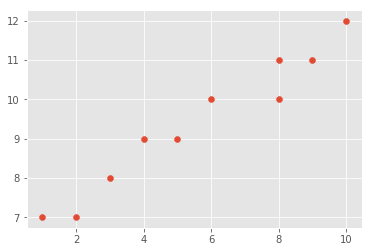
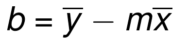
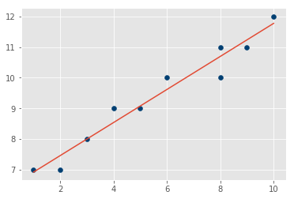
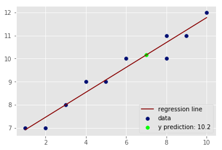

# Calculating slope and intercept for best fit line

## SWBAT
* Calculate the slope of a line
* Calculate the y-intercept 
* Draw a regression line based on slope and intercept
* Predict the label of a previously unseen data element

## Introduction

Regression analysis forms the basis of machine learning experiments. Understanding regression will help you to get the foundations of most machine learing algorithms. Ever wondered what's at the heart of an artificil neural network processing unstructured data like music and graphics ! Its lienar regression.

A first step towards understanding regression is getting a clear idea about "linear" regression and basic linear algebra. 

The calculation for the best-fit line's slope, `m` is calculated as :


As our previous lesson, let's break down the formula into its parts. First we shall import the required libraries and define some data points to work with. 


```python
# import necessary libraries

import numpy as np
import matplotlib.pyplot as plt
from matplotlib import style
style.use('ggplot')
```

We shall first create some dummy data as numpy arrays and plot it to view the variability of data. Use following values for this example:

X = [1,2,3,4,5,6,8,8,9,10]

Y = [7,7,8,9,9,10,10,11,11,12]


```python
# Initialize vectors X and Y with given values and create a scatter plot
X = np.array([1,2,3,4,5,6,8,8,9,10], dtype=np.float64)
Y = np.array([7,7,8,9,9,10,10,11,11,12], dtype=np.float64)
plt.scatter(X,Y)
plt.show()
```





In a data analysis context, we can think of these points as vector x being the features and vector y being the labels for given features. 

As a reminder, the calculation for the best-fit line's y-intercept is:




To avoid doing all the calculations, we can use numpy's built in `polyfit()` function (stands for polynomial fit). 

https://www.scipy-lectures.org/intro/numpy/auto_examples/plot_polyfit.html


```python
# Use np.polyfit(dim1, dim2, degree) with 1st degree polynomial i.e. use 1
m,b = np.polyfit(X, Y, 1)
m,b
```


    (0.5393518518518524, 6.379629629629629)


We now have a working model with `m` and `b` as model parameters. We can create a line for the data points using calculated slope and intercept:

Recall that `y=mx+b`. We can now use slope and ingercept values along with X data points (features) to calculate the Y data points (labels) ofr the regression line. 


```python
# Define a function reg_line that takes in slope, intercept and x points and returns a regression line
def reg_line (m, b, xs):
    
    return [(m*x)+b for x in xs]

regression_line = reg_line(m,b,X)
```

Now that we have calculated the regression line, we can plot the data points and regression line for visual inspection.


```python
# Plot the x-points, y-points as scatter plot and draw the regression line calculated above
plt.scatter(X,Y,color='#003F72')
plt.plot(X, regression_line)
plt.show()
```





## Predicting label for new data

So, how might you go about actually making a prediction based on this model you just made?

Now that we have a working model with m and b as model parameters. We can fill in a value of x with these parameters to identify a corrosponding value of y according to our model.  

Let's try to find a y prediction for a new value of x = 7 and unknown y, and plot the new prediction with existing data 


```python
x_new = 7
y_predicted = (m*x_new)+b
y_predicted

# 10.155092592592592
```


    10.155092592592595


```python
# Plot the x-points, y-points as scatter plot and draw the regression line calculated above + the new data point

plt.scatter(X,Y,color='#000F72',label='data')
plt.plot(X, regression_line, color='#880000', label='regression line')
plt.scatter(x_new,y_predicted,color='#00ff00',label='y prediction: '+ str(np.round(y_predicted,1)))
plt.legend(loc=4)
plt.show()
```





We now know how to create our own models, which is great, but we're stilling missing something integral: how accurate is our model? This is the topic for discussion in the next lab.

## Summary

In this lesson, we learnt how we can draw a best fit line for given data labels and features , by first calculating the slope and intercept. The calculated regression line was then used to predict the label (y-value) of a previously unseen feature (x-value). The lesson uses a simple set of data points for demonstration. Students should be able to plug in other datasets and practice with predictions for accuracy. 
